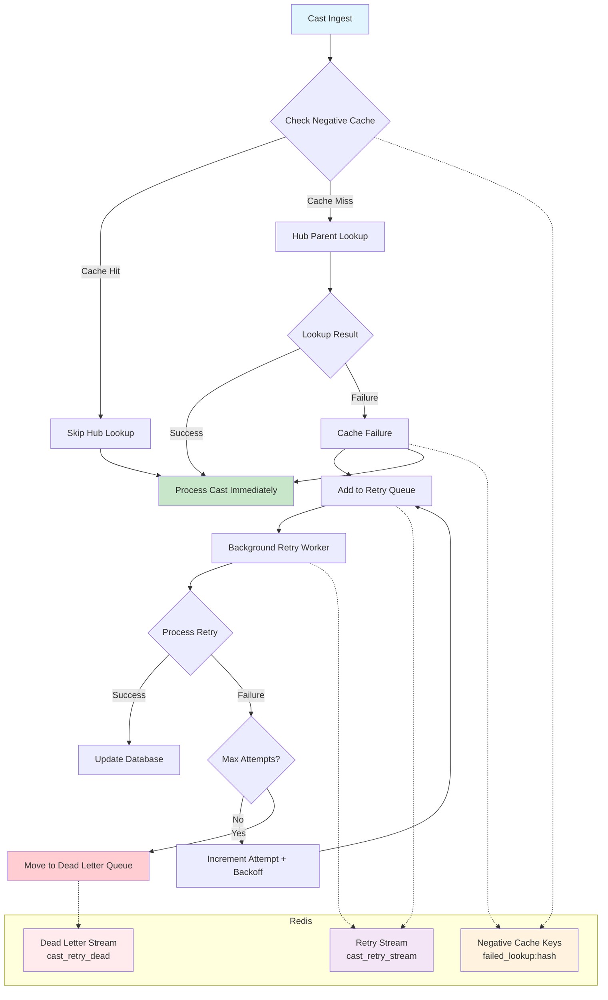

# Cast Retry System - Performance Fix for Parent Lookup Failures

## Problem Statement

Waypoint was experiencing severe performance degradation during cast ingestion:

- **Symptom**: Cast processing taking 6-10 seconds each instead of milliseconds
- **Root Cause**: Missing parent data due to snapchain restarts causing data gaps
- **Impact**: 10+ hour ingestion lag, constant "Max depth 100 reached when finding root parent" warnings
- **Logs**: Warnings every 10-20 seconds indicating expensive recursive parent lookups hitting timeout limits

## Root Cause Analysis

When parent casts are missing from the hub due to data gaps:
1. `find_root_parent_hub()` attempts to traverse parent-child relationships
2. Missing parents cause traversal to continue searching deeper
3. Function hits MAX_DEPTH=100 limit and times out after ~10 seconds
4. This blocks the entire cast processing pipeline
5. Redis pool shows high pressure from long-running connections

## Solution: Negative Cache + Retry Queue System

### Architecture Overview



### Message Flow Example

Let me walk you through exactly what happens when a cast with a missing parent comes in:

#### Scenario: Cast with Missing Parent
**Cast arrives**: "Reply to cast 0xABC123 from user 456"

#### Step 1: Normal Processing Starts
```rust
// In database processor
find_root_parent_hub_with_retry(
    hub_client, 
    redis,
    parent_fid: Some(456),
    parent_hash: Some(0xABC123),
    ...
)
```

#### Step 2: Check Negative Cache
```rust
// Check Redis: "failed_lookup:ABC123"
if redis.exists("failed_lookup:ABC123") {
    // Cache hit! We know this parent lookup failed recently
    return Ok(None); // Skip expensive hub call
}
```

#### Step 3A: Cache Miss → Try Hub Lookup
```rust
// Not in cache, try the hub
match hub_client.get_cast(456, 0xABC123).await {
    Ok(None) => {
        // Parent cast not found in hub (data gap!)
        // This is where the old code would timeout after 10 seconds
    }
}
```

#### Step 4: Handle the Failure
```rust
// Cache this failure for 5 minutes
redis.setex("failed_lookup:ABC123", 300, "1");

// Add to retry queue
redis.xadd("cast_retry_stream", {
    "cast_fid": 789,
    "cast_hash": "DEF456", 
    "parent_hash": "ABC123",
    "error": "Cast not found in hub",
    "attempt": 1
});

// Return None (no root parent found)
return Ok(None);
```

#### Step 5: Cast Processing Continues
```rust
// Back in database processor
match find_root_parent_hub_with_retry(...).await {
    Ok(None) => {
        // No problem! Insert cast with root_parent_fid = NULL
        insert_cast_with_null_parent();
    }
}
```

**Total time: ~10 milliseconds** (instead of 10 seconds!)

---

#### Meanwhile, in the Background...

#### Step 6: Retry Worker Picks It Up
```rust
// Every 10 seconds, retry worker checks queue
let messages = redis.xreadgroup("retry_workers", "worker_1", "cast_retry_stream", 10);

// Finds our message: "cast_hash=DEF456, parent_hash=ABC123, attempt=1"
```

#### Step 7: Retry the Lookup
```rust
// Try again (maybe backfill fixed it?)
match find_root_parent_hub_with_retry(...).await {
    Ok(Some(root_info)) => {
        // Success! Update the database
        update_cast_root_parent(DEF456, root_info);
        redis.xack(); // Remove from retry queue
    },
    Err(_) => {
        // Still failing, retry later with exponential backoff
        attempt = 2;
        redis.xadd("cast_retry_stream", {..., "attempt": 2});
    }
}
```

#### Step 8: After 3 Failed Attempts
```rust
if attempt >= 3 {
    // Give up, move to dead letter queue
    redis.xadd("cast_retry_dead", {
        "cast_hash": "DEF456",
        "final_error": "Cast not found after 3 attempts"
    });
}
```

#### The Key Difference

**Old behavior:**
```
Cast arrives → Try hub lookup → Timeout after 10 seconds → Process cast
```

**New behavior:**
```
Cast arrives → Check cache → Skip hub lookup → Process cast immediately (10ms)
                     ↓
              Background worker retries later
```

The cast gets processed **immediately** with `root_parent = NULL`, then we fix the parent relationship later when the data becomes available. This is why your ingestion speed will go from 6-10 casts/minute back to thousands/minute!

### Components Implemented

#### 1. Negative Cache (`src/core/root_parent_hub.rs`)
- **Purpose**: Prevent repeated expensive lookups for known missing parents
- **Implementation**: Redis keys with pattern `failed_lookup:{parent_hash}`
- **TTL**: 5 minutes (short enough to retry when backfill fixes gaps)
- **Benefit**: Sub-millisecond cache checks vs 10-second hub timeouts

#### 2. Retry Queue System (`src/core/root_parent_hub.rs`)
- **Retry Stream**: `cast_retry_stream` - Failed casts awaiting retry
- **Dead Letter**: `cast_retry_dead` - Permanently failed after 3 attempts  
- **Data Stored**: Cast metadata, parent info, error details, attempt count
- **Backoff**: Exponential delays (2^attempt seconds, max 5 minutes)

#### 3. Smart Error Classification (`src/core/root_parent_hub.rs`)
```rust
"Max depth 100" → 5 minute retry (main issue - data gaps)
"timeout"/"connection" → 1 minute retry (hub issues)  
"not found" → 5 minute retry (missing data)
"decode"/"Invalid" → Permanent failure (bad data)
Default → 2 minute retry (unknown issues)
```

#### 4. Updated Cast Processor (`src/processor/database.rs`)
- **Before**: `find_root_parent_hub()` - blocks on failures
- **After**: `find_root_parent_hub_with_retry()` - fails fast with caching
- **Behavior**: Continues cast processing with `root_parent = NULL` instead of hanging

#### 5. Background Retry Worker (`src/commands/retry_casts.rs`)
- **Consumer Group**: `retry_workers` processes retry stream
- **Batch Processing**: Handles 10 messages per batch
- **Failure Handling**: Increments attempt count, applies backoff, moves to DLQ
- **Admin Functions**: Clear cache, reprocess dead letters, get stats

## Monitoring & Operations

### Key Metrics to Watch
```bash
# Retry queue depth
XLEN cast_retry_stream

# Dead letter count  
XLEN cast_retry_dead

# Consumer group lag
XINFO GROUPS cast_retry_stream

# Negative cache size
SCAN 0 MATCH failed_lookup:* COUNT 1000
```

### Admin Commands
```rust
// Clear negative cache (force retry all cached failures)
CastRetryAdmin::clear_negative_cache()

// Reprocess dead letters (move back to retry queue)
CastRetryAdmin::reprocess_dead_letters()

// Get queue statistics
CastRetryAdmin::get_retry_stats()
```

### Operational Procedures

#### During Backfill Operations
1. Monitor retry queue growth
2. Clear negative cache after backfill completes
3. Watch for dead letter queue growth

#### Troubleshooting High Retry Rates
1. Check hub connectivity and performance
2. Verify data gap resolution progress
3. Consider increasing retry limits for temporary issues

#### Emergency Recovery
```bash
# If retry queue grows too large, temporarily disable
# by not running the retry worker

# Clear all cached failures to force immediate retries
kubectl exec -it waypoint-redis -- redis-cli --scan --pattern "failed_lookup:*" | xargs redis-cli DEL

# Reprocess everything in dead letter queue
CastRetryAdmin::reprocess_dead_letters()
```