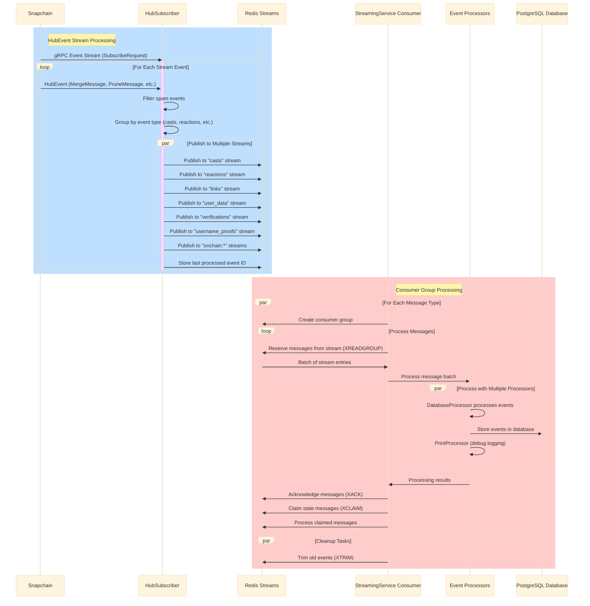

# Waypoint Architecture

This document provides an overview of Waypoint's architecture, which consists of two main components:
1. A streaming service for processing real-time Snapchain events through Redis consumer groups
2. A backfill system for historical data processing using a FID-based approach

## Streaming Service Architecture



## Component Descriptions

### 1. HubSubscriber

The HubSubscriber component establishes a gRPC connection to a Snapchain node and consumes the event stream in real-time:

- Connects to the node using a gRPC streaming API
- Subscribes to specific event types (MergeMessage, PruneMessage, RevokeMessage, etc.)
- Filters spam messages (currently pulling from Warpcast labels, but will be expanded to include other spam detection methods)
- Groups events by type (casts, reactions, links, etc.)
- Publishes events to Redis streams
- Tracks the last processed event ID for resuming after restarts

### 2. Redis Streams

Redis streams serve as a durable message queue between the HubSubscriber and Consumer:

- Provides persistent storage for events in transit
- Enables backpressure handling through consumer groups
- Maintains separate streams for different event types
- Supports event acknowledgment and claiming of stale messages
- Allows trimming of old events to manage memory usage

### 3. StreamingService Consumer

The Consumer component processes events from Redis streams:

- Creates consumer groups for each message type
- Reads messages in batches for efficient processing
- Handles concurrent processing of different message types
- Manages acknowledgments of successfully processed messages
- Claims and reprocesses stale/stuck messages
- Implements graceful shutdown procedures

### 4. Event Processors

Processors handle the actual business logic for the events:

- **DatabaseProcessor**: Persists events to PostgreSQL
  - Handles different message types (casts, reactions, etc.)
  - Manages transaction boundaries
  - Implements upsert logic for existing records

- **PrintProcessor**: Optional debug processor
  - Logs events for debugging and monitoring
  - Can be enabled via configuration

### 5. Database (PostgreSQL)

The PostgreSQL database is the final destination for processed events:

- Stores normalized Farcaster data
- Provides relational model for querying
- Supports vector extensions for similarity search
- Maintains indexes for efficient querying

### 6. Data Access Layer

The Data Access Layer uses the Data Context pattern for accessing external resources:

```mermaid
%%{init: {'theme': 'base', 'themeVariables': { 'background': '#f5f5f5' }}}%%
classDiagram
    class DataContext~DB, HC~ {
        +database: Option~DB~
        +hub_client: Option~HC~
        +get_user_data_by_fid(fid, limit) 
        +get_user_data(fid, data_type)
        +get_username_proofs_by_fid(fid)
        +get_verifications_by_fid(fid, limit)
    }
    
    class Database {
        <<trait>>
        +get_message(id, message_type)
        +get_messages_by_fid(fid, message_type, limit, cursor)
        +store_message(message)
        +delete_message(id, message_type)
    }
    
    class HubClient {
        <<trait>>
        +get_user_data_by_fid(fid, limit)
        +get_user_data(fid, data_type)
        +get_username_proofs_by_fid(fid)
        +get_verifications_by_fid(fid, limit)
    }
    
    class PostgresDatabaseClient {
        +db: Arc~DbPool~
        +table_for_message_type(message_type)
    }
    
    class FarcasterHubClient {
        +hub: Arc~Mutex~Hub~~
        +format_hex(bytes)
    }
    
    class DataContextBuilder~DB, HC~ {
        +database: Option~DB~
        +hub_client: Option~HC~
        +new()
        +with_database(database)
        +with_hub_client(hub_client)
        +build()
    }
    
    Database <|.. PostgresDatabaseClient : implements
    HubClient <|.. FarcasterHubClient : implements
    DataContext ..> Database : uses
    DataContext ..> HubClient : uses
    DataContextBuilder ..> DataContext : builds
</mermaid>

- **Data Context Pattern**: Provides a unified interface for accessing multiple data sources
  - Uses generic traits for Database and HubClient interfaces
  - Prioritizes Hub data with database fallback
  - Supports dependency injection through builder pattern
  - Enables swappable implementations for testing

- **Database Access**: Read-only access to PostgreSQL
  - Implements the Database trait
  - Provides SQL query generation for different message types
  - Returns domain objects from database records

- **Hub Access**: Direct access to Snapchain Hub API
  - Implements the HubClient trait
  - Converts gRPC responses to domain objects
  - Handles connection management and error handling

## Backfill System Architecture

### FID-based Backfill

The FID-based approach processes messages by Farcaster user ID (FID):

```mermaid
%%{init: {'theme': 'base', 'themeVariables': { 'background': '#f5f5f5' }}}%%
sequenceDiagram
    participant Queue as Redis Queue
    participant Worker as FID Worker
    participant Hub as Snapchain Hub
    participant Processor as Database Processor
    participant DB as PostgreSQL

    Queue->>Worker: BackfillJob with FIDs [1,2,3,...]
    
    loop For Each FID
        Worker->>Hub: Request all message types for FID
        Hub->>Worker: Messages (casts, reactions, etc.)
        
        par Process Different Message Types
            Worker->>Processor: Process casts
            Worker->>Processor: Process reactions
            Worker->>Processor: Process links
            Worker->>Processor: Process user_data
            Worker->>Processor: Process verifications
        end
        
        Processor->>DB: Store processed messages
    end
    
    Worker->>Queue: Mark job as completed
```

## Key Features

- **FID-based Backfill**: Optimized for targeted user data processing

- **Memory efficient**: Optimized Snapchain event processing
- **Efficient Buffer Management**: Carefully managed memory allocations
- **Batch Processing**: Processes events in batches for efficiency
- **Concurrency Control**: Manages parallel processing with semaphores
- **Error Handling**: Implements retries with exponential backoff
- **Graceful Shutdown**: Proper shutdown sequence for minimal data loss
- **Connection Monitoring**: Detects and recovers from stale connections
- **Dead Letter Queuing**: Optionally moves problematic messages to dead letter queues
- **Checkpointing**: Tracks progress for resumable operations