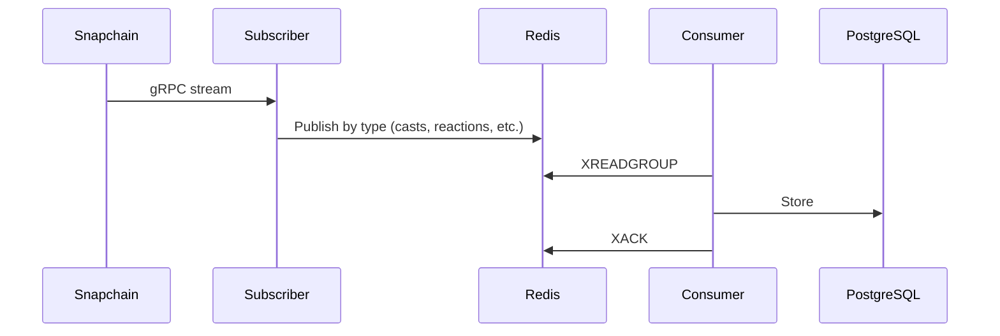
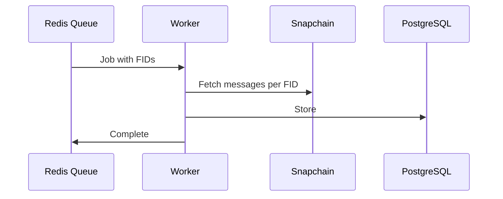
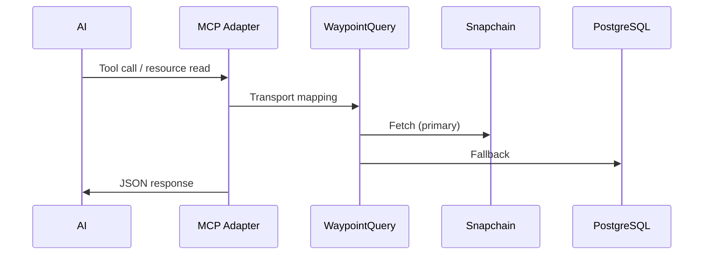

# Architecture

Three main components:
1. **Streaming** - Real-time Snapchain events via gRPC → Redis → PostgreSQL
2. **Backfill** - Historical data via queue/worker pattern
3. **MCP** - AI assistant data access

## Service Modes

Waypoint supports three service modes for horizontal scaling:

```bash
waypoint start              # Both producer and consumer (default)
waypoint start producer     # Producer only: Hub → Redis
waypoint start consumer     # Consumer only: Redis → PostgreSQL
```

This enables independent scaling of producers and consumers via HPA or similar.

## Streaming



**Flow:**
- Subscriber connects to Snapchain gRPC, filters spam, groups by type
- Redis streams provide durability and backpressure
- Consumer groups enable parallel processing
- Stale messages get reclaimed via XCLAIM

## Backfill



**Flow:**
- Queue service populates Redis with FID batches
- Workers pull jobs atomically (BRPOP)
- Each job reconciles all message types for its FIDs
- Multiple workers scale horizontally

## MCP



- `McpService` handles runtime lifecycle and server startup.
- `WaypointMcpTools` is a thin protocol adapter (`rmcp` schemas + routing).
- `WaypointQuery` owns transport-agnostic query/business logic shared across transports.
- `WaypointQuery` returns typed query results; `WaypointMcpTools` serializes JSON for MCP responses.

See [mcp.md](mcp.md) for tool details.

## Data Access

Uses DataContext pattern with Hub-primary, DB-fallback strategy:

```
DataContext<DB, HC>
  ├── database: Option<DB>    # PostgreSQL
  └── hub_client: Option<HC>  # Snapchain gRPC
```

See [data-architecture.md](data-architecture.md) for schema.
