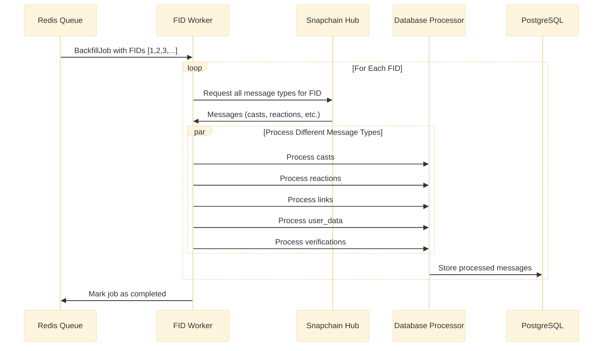
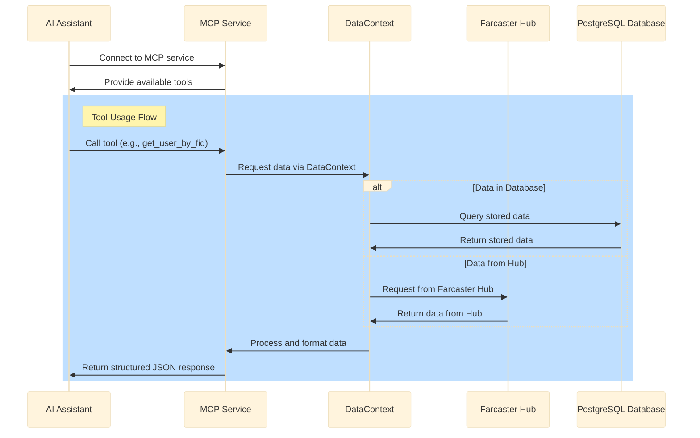

# Waypoint Architecture

This document provides an overview of Waypoint's architecture, which consists of three main components:
1. A streaming service for processing real-time Snapchain events through Redis consumer groups
2. A backfill system for historical data processing using a FID-based approach
3. A Model Context Protocol (MCP) service for AI assistants to access Farcaster data

For details on the data architecture and DataContext pattern, see [data-architecture.md](data-architecture.md).

## Streaming Service Architecture

## Component Descriptions

### 1. HubSubscriber

The HubSubscriber component establishes a gRPC connection to a Snapchain node and consumes the event stream in real-time:

- Connects to the node using a gRPC streaming API
- Subscribes to specific event types (MergeMessage, PruneMessage, RevokeMessage, etc.)
- Filters spam messages (currently pulling from Warpcast labels, but will be expanded to include other spam detection methods)
- Groups events by type (casts, reactions, links, etc.)
- Publishes events to Redis streams
- Tracks the last processed event ID for resuming after restarts

### 2. Redis Streams

Redis streams serve as a durable message queue between the HubSubscriber and Consumer:

- Provides persistent storage for events in transit
- Enables backpressure handling through consumer groups
- Maintains separate streams for different event types
- Supports event acknowledgment and claiming of stale messages
- Allows trimming of old events to manage memory usage

### 3. StreamingService Consumer

The Consumer component processes events from Redis streams:

- Creates consumer groups for each message type
- Reads messages in batches for efficient processing
- Handles concurrent processing of different message types
- Manages acknowledgments of successfully processed messages
- Claims and reprocesses stale/stuck messages
- Implements graceful shutdown procedures

### 4. Event Processors

Processors handle the actual business logic for the events:

- **DatabaseProcessor**: Persists events to PostgreSQL
  - Handles different message types (casts, reactions, etc.)
  - Manages transaction boundaries
  - Implements upsert logic for existing records

- **PrintProcessor**: Optional debug processor
  - Logs events for debugging and monitoring
  - Can be enabled via configuration

### 5. Database (PostgreSQL)

The PostgreSQL database is the final destination for processed events:

- Stores normalized Farcaster data
- Provides relational model for querying
- Supports vector extensions for similarity search
- Maintains indexes for efficient querying

## Backfill System Architecture

### FID-based Backfill

The FID-based approach processes messages by Farcaster user ID (FID):

## MCP Service Architecture

The MCP (Model Context Protocol) service enables AI assistants to access Farcaster data through a standardized protocol.

### MCP Service Components

- **MCP Service Handler**: Implements the Model Context Protocol server
- **Tool Implementations**: Methods for accessing different types of Farcaster data
- **DataContext Integration**: Uses the DataContext pattern to access data
- **Response Formatting**: Converts Farcaster data into structured JSON responses
- **Protocol Support**: Implements SSE transport for server-sent events

## Key Features

- **FID-based Backfill**: Optimized for targeted user data processing
- **MCP Integration**: Provides AI assistants with structured access to Farcaster data
- **Memory efficient**: Optimized Snapchain event processing
- **Efficient Buffer Management**: Carefully managed memory allocations
- **Batch Processing**: Processes events in batches for efficiency
- **Concurrency Control**: Manages parallel processing with semaphores
- **Error Handling**: Implements retries with exponential backoff
- **Graceful Shutdown**: Proper shutdown sequence for minimal data loss
- **Connection Monitoring**: Detects and recovers from stale connections
- **Dead Letter Queuing**: Optionally moves problematic messages to dead letter queues
- **Checkpointing**: Tracks progress for resumable operations