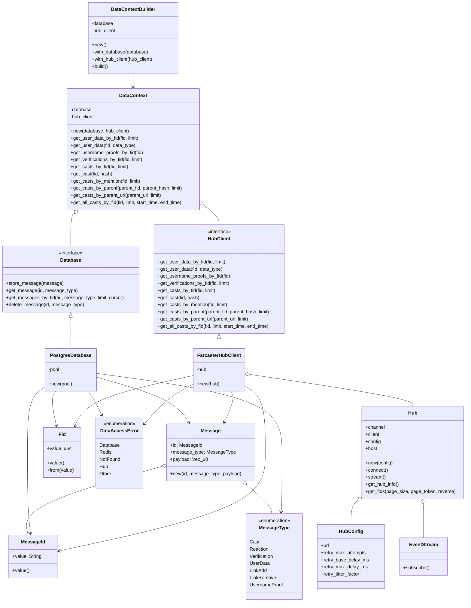

# Waypoint Data Architecture

This document provides a UML class diagram and explanation of Waypoint's data architecture, which follows the DataContext pattern for data access.

## Class Diagram



## Architecture Overview

Waypoint's data architecture follows the DataContext pattern to provide unified data access across different sources. This architecture enables:

1. Clean abstraction of data access logic
2. Consistent interfaces for both database and hub operations
3. Flexible composition through dependency injection
4. Testability with mock implementations
5. Configurable storage efficiency with optional raw message storage

### Key Components

#### Domain Entities

- **Message**: The core entity representing a Farcaster message
- **MessageId**: Unique identifier for messages
- **MessageType**: Enumeration of message types (Cast, Reaction, etc.)
- **Fid**: Farcaster ID representing a user

#### Core Interfaces

- **Database**: Interface for local database storage and retrieval
- **HubClient**: Interface for accessing the Farcaster Hub API

#### DataContext Pattern

- **DataContext**: Main data access layer that coordinates between local database and hub client
- **DataContextBuilder**: Builder pattern for creating DataContext instances with different components

#### Concrete Implementations

- **PostgresDatabase**: PostgreSQL implementation of the Database interface
- **FarcasterHubClient**: Implementation of HubClient for Farcaster Hub communication
- **Hub**: Low-level client for gRPC communication with the Hub

### Design Patterns

1. **DataContext Pattern**: Centralizes data access operations and coordinates between different data sources
2. **Builder Pattern**: Simplifies the creation of complex DataContext objects
3. **Dependency Injection**: Interfaces injected into services that need them
4. **Error Handling**: Unified error type (DataAccessError) for all data operations

### Data Flow

1. Services request data from the DataContext
2. DataContext determines whether to fetch from local database or hub
3. If data exists locally, it's returned from the database
4. If not, it's fetched from the Farcaster Hub
5. Results are processed and returned to the service layer

This architecture allows Waypoint to efficiently manage data access across multiple sources while maintaining a consistent interface for the rest of the application.

### Storage Optimization

Waypoint includes configurable storage options to optimize database usage:

#### Message Storage

By default, Waypoint stores all messages in the `messages` table for maximum data fidelity. However, this can be disabled to save storage space:

```toml
[database]
store_messages = false
```

When `store_messages` is set to `false`, the system will:

1. Skip storing any data in the `messages` table completely
2. Still store the processed data in type-specific tables (casts, reactions, etc.)
3. Significantly reduce database size for high-volume installations

This is particularly useful for deployments that:
- Have limited storage capacity
- Process a high volume of messages
- Don't require the messages table for compliance or recovery purposes
- Only need the structured data in the type-specific tables

The processed data (casts, reactions, etc.) remains fully available regardless of this setting.
